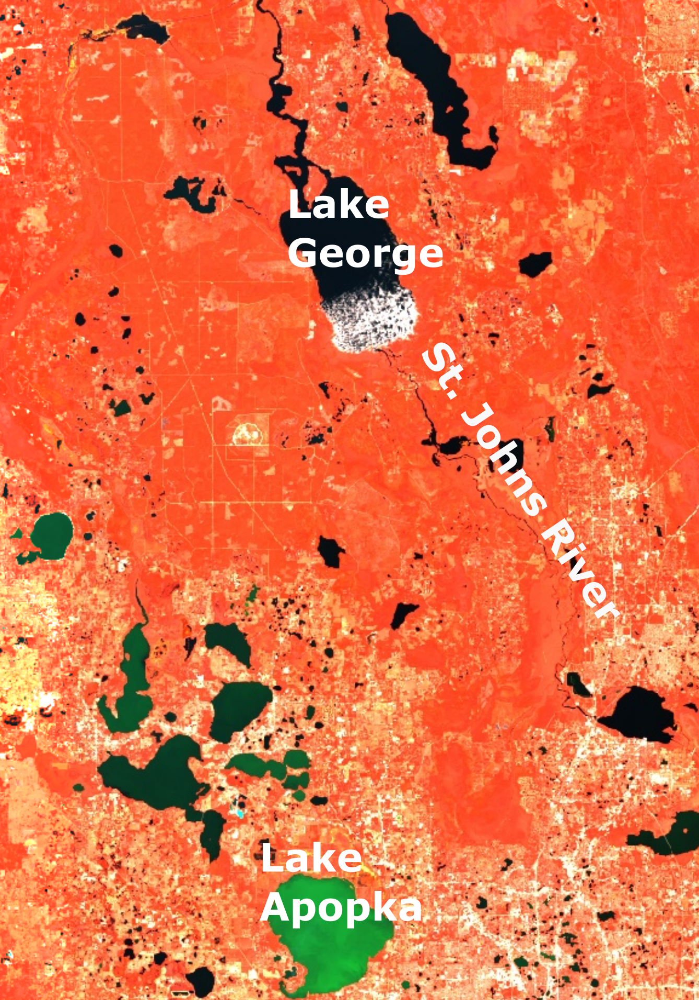
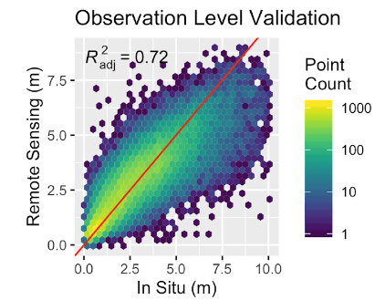
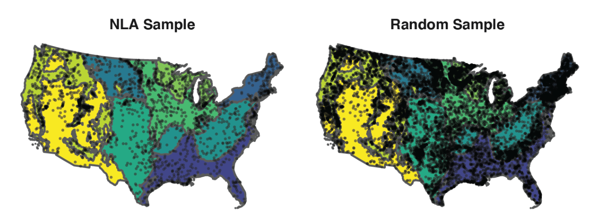

# ML/AI needs data

<iframe width="560" height="315" src="https://www.youtube.com/embed/EWKAgwgqXB4?start=181" frameborder="0" allow="accelerometer; autoplay; encrypted-media; gyroscope; picture-in-picture" allowfullscreen></iframe>

Anokhin et al., 2020p - 20,000 photos from the internet

## For many fields we have it

<embed src="https://en.wikipedia.org/wiki/List_of_datasets_for_machine-learning_research" style="width:1100px; height: 700px;">


## Historically, not for water quality remote sensing


Topp et al., 2020

## 


# Remote sensing of water quality?


## 

```{r, echo=F}

```


##


##


## 


## From image to estimate


# Local to global

## AquaSat

 - USGS, Alison Applng
 - UNC-Chapel Hill, Tamlin Pavelsky, Simon Topp, Xiao Yang
 - UWash, David Butman, Catherine Kuhn
 

## 

<iframe width="560" height="315" src="https://www.youtube.com/embed/6LZURaRH3Ws" frameborder="0" allow="accelerometer; autoplay; encrypted-media; gyroscope; picture-in-picture" allowfullscreen></iframe>


## Global Sediment


# What AquaSat can do

# Lake Clarity

 - Simon Topp
 - Tamlin Pavelsky
 - Xiao Yang
 - Claire Griffin
 - Emily Stanley

## 




##


##



##


# Riverine Sediment

  - John Gardner
  - Xiao Yang
  - Tamlin Pavelsky
  - Simon Topp
  
  
##


##


## 

<embed src="images/tss.zoom.html" style="width:1100px; height: 700px;">


## 


##


# Riverine DOC

  - Matt Cohen
  - Jim Jawitz
  
##


## 

<embed src="images/doc_map_st.html" style="width:1100px; height: 700px;">

# Riverine algae dynamics

  - Jake Diamond
  - Gilles Pinay
  - Florentina Moatar
  - Matt Cohen
  - John Gardner


## Loire river


##


##


# Future work

## Using KGML/PGDL in our work
 
## Transfer learning 
 
 
 
## Integrated lake/river/coastal approaches
 
 
# Why not more open datasets? 

  - Historically a lot harder
  
  - Harmonization is the worst
  
  - Other typical barriers to data publishing
  
  - But that's all changing...
  
# Questions?

<iframe width="560" height="315" src="https://www.youtube.com/embed/6LZURaRH3Ws" frameborder="0" allow="accelerometer; autoplay; encrypted-media; gyroscope; picture-in-picture" allowfullscreen></iframe>
